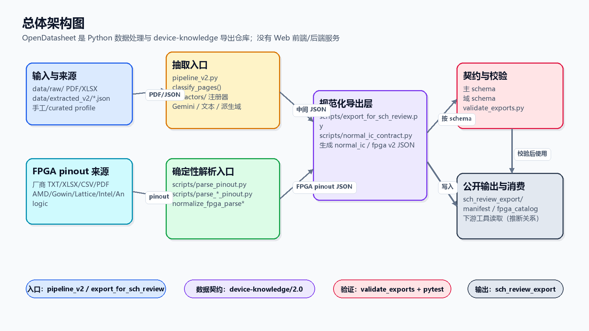
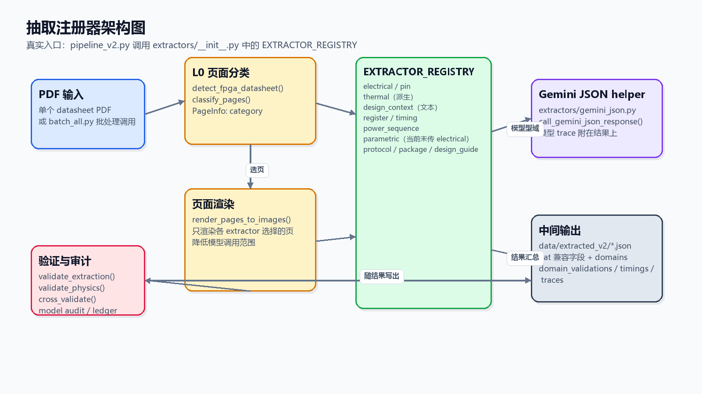
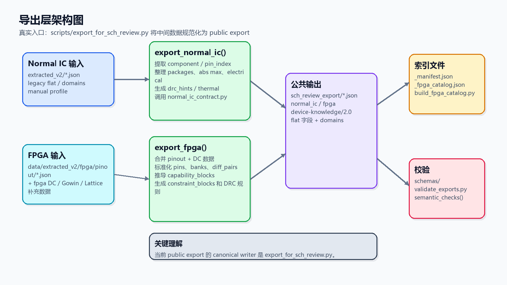
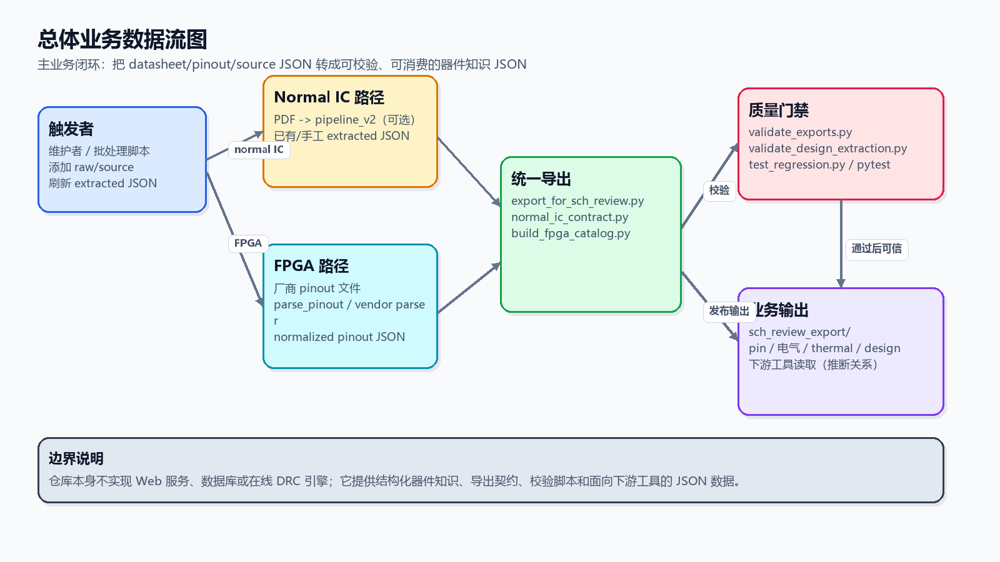
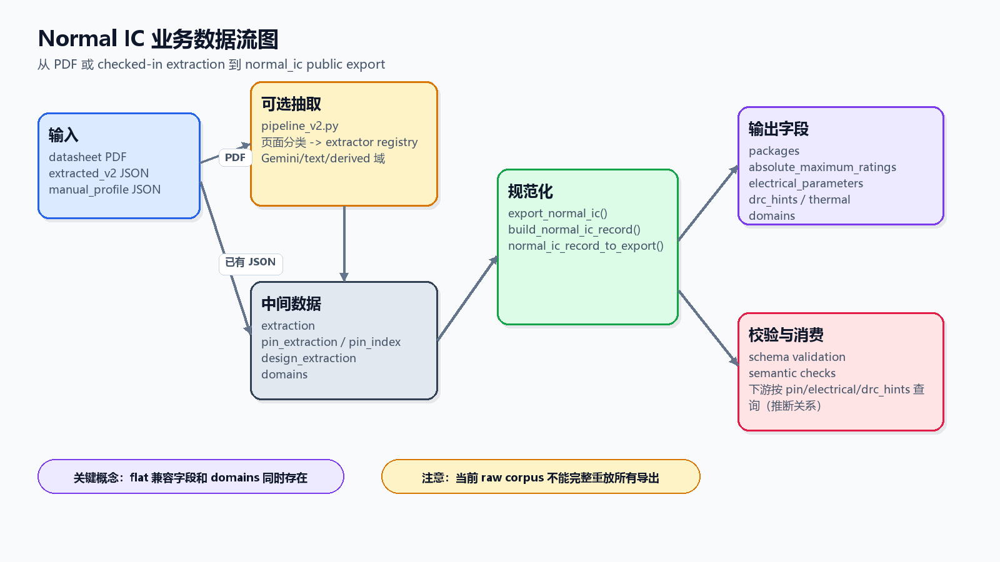
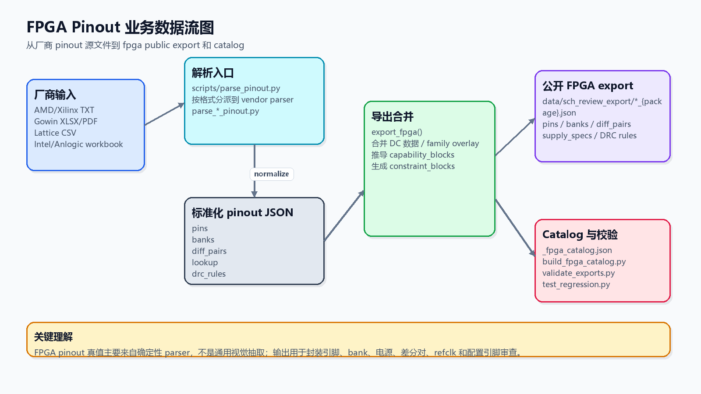
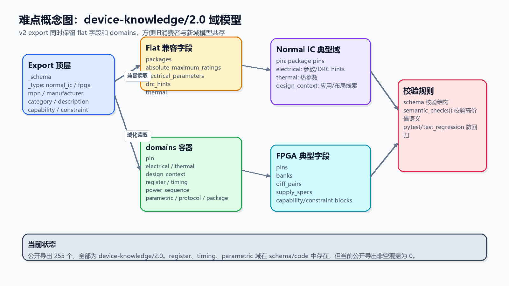

# OpenDatasheet

[](https://github.com/joyhpc/opendatasheet/actions/workflows/ci.yml)
[](./schemas/sch-review-device.schema.json)
[](./data/sch_review_export/)
[](./docs/current-state.md)

OpenDatasheet 是一个面向原理图审核和硬件审查的结构化器件知识仓库。它把 datasheet 抽取结果、手工维护 profile、FPGA pinout 解析结果和 schema 校验组合起来，生成下游工具可以读取的 `device-knowledge/2.0` JSON。

这个仓库当前不是 Web 应用，也没有前端页面、后端 API 服务或数据库服务。它的主要形态是 Python 数据处理脚本、抽取模块、JSON Schema、已检入的数据文件和测试/校验入口。

如果文档、代码、schema 和已检入 JSON 互相冲突，优先级是：

1. [schemas/](./schemas/)
2. [scripts/export_for_sch_review.py](./scripts/export_for_sch_review.py)
3. [scripts/validate_exports.py](./scripts/validate_exports.py)
4. [data/sch_review_export/](./data/sch_review_export/)
5. 文档

## 项目结构与文件索引

下面只列出理解项目架构和业务流转时最重要的文件与目录，缓存、日志、临时文件和生成过程中的次要产物没有列入。

### 新手入口

| 路径 | 作用 |
|------|------|
| [README.md](./README.md) | 项目总览，帮助第一次接触项目的人理解目录、入口、架构和数据流。 |
| [GUIDE.md](./GUIDE.md) | 文档阅读路线图，告诉你不同任务应该先看哪几份文档。 |
| [docs/current-state.md](./docs/current-state.md) | 当前事实快照，包括导出数量、schema 版本、数据来源和已知边界。 |
| [docs/architecture.md](./docs/architecture.md) | 代码校准过的架构说明，适合在修改抽取、导出、schema 或验证逻辑前阅读。 |
| [docs/index.md](./docs/index.md) | 文档总索引，并区分当前事实文档与历史设计材料。 |

### 核心入口文件

| 路径 | 作用 |
|------|------|
| [pipeline_v2.py](./pipeline_v2.py) | 可选的 datasheet PDF 抽取入口，负责页面分类、调用 extractor registry、组装中间 JSON。 |
| [batch_all.py](./batch_all.py) | 批量运行抽取流程的脚本入口，用于对多个 datasheet 逐个调用 pipeline。 |
| [process_one.py](./process_one.py) | 单文件处理辅助入口，适合调试某一个 datasheet。 |
| [scripts/export_for_sch_review.py](./scripts/export_for_sch_review.py) | 当前公开导出层的 canonical writer，把中间数据转换成 `data/sch_review_export/` 下的 public JSON。 |
| [scripts/parse_pinout.py](./scripts/parse_pinout.py) | FPGA pinout 统一解析入口，根据源文件格式分派到具体 vendor parser。 |
| [scripts/validate_exports.py](./scripts/validate_exports.py) | public export 的 schema 与语义校验入口。 |
| [scripts/run_checks.sh](./scripts/run_checks.sh) | 本地综合检查入口，串联常用校验、回归和测试。 |
| [scripts/doctor.py](./scripts/doctor.py) | 环境检查入口，用于确认 Python、依赖、关键路径和可选凭据状态。 |

### 抽取模块

| 路径 | 作用 |
|------|------|
| [extractors/](./extractors/) | domain-driven 抽取模块目录，每个 extractor 负责一个知识域。 |
| [extractors/base.py](./extractors/base.py) | 所有 extractor 的抽象接口，规定 `select_pages()`、`extract()`、`validate()` 三步。 |
| [extractors/__init__.py](./extractors/__init__.py) | `EXTRACTOR_REGISTRY` 注册表，决定 pipeline 调用哪些 domain extractor 以及调用顺序。 |
| [extractors/gemini_json.py](./extractors/gemini_json.py) | Gemini JSON 调用封装，负责模型响应解析、重试策略和 trace 信息。 |
| [extractors/electrical.py](./extractors/electrical.py) | 抽取绝对最大额定值、电气特性和基础电气校验。 |
| [extractors/pin.py](./extractors/pin.py) | 抽取普通 IC 或 FPGA 的 pin 定义，并生成 package-aware pin 数据。 |
| [extractors/thermal.py](./extractors/thermal.py) | 从 electrical 结果中派生 thermal 相关条目。 |
| [extractors/design_context.py](./extractors/design_context.py) | 直接读取 PDF 文本，抽取应用、布局、外部元件和公式线索。 |
| [extractors/design_guide.py](./extractors/design_guide.py) | 抽取或合并设计指南类信息，例如电源、配置和布局规则。 |
| [extractors/register.py](./extractors/register.py) | register domain extractor，当前 public export 中该域非空覆盖为 0。 |
| [extractors/timing.py](./extractors/timing.py) | timing domain extractor，当前 public export 中该域非空覆盖为 0。 |
| [extractors/power_sequence.py](./extractors/power_sequence.py) | power sequence domain extractor，用于电源时序/启动规则。 |
| [extractors/parametric.py](./extractors/parametric.py) | parametric domain extractor 已注册；当前 pipeline orchestration 没有把 electrical 结果传给它，public export 非空覆盖为 0。 |
| [extractors/protocol.py](./extractors/protocol.py) | protocol domain extractor，用于接口协议、约束和命令类信息。 |
| [extractors/package.py](./extractors/package.py) | package domain extractor，用于封装、尺寸、焊接和机械相关信息。 |

### 导出、解析与规范化脚本

| 路径 | 作用 |
|------|------|
| [scripts/normal_ic_contract.py](./scripts/normal_ic_contract.py) | Normal IC 导出模型构建器，把 packages、electrical、thermal、design_context 等整理成 v2 export。 |
| [scripts/device_export_view.py](./scripts/device_export_view.py) | export 读取兼容层，让消费者能同时读取 flat 字段和 `domains` 字段。 |
| [scripts/build_fpga_catalog.py](./scripts/build_fpga_catalog.py) | 根据 FPGA public export 生成 `_fpga_catalog.json`。 |
| [scripts/parse_fpga_pinout.py](./scripts/parse_fpga_pinout.py) | AMD/Xilinx TXT pinout 解析器，生成 pins、banks、diff_pairs、lookup 和 DRC 规则。 |
| [scripts/parse_gowin_pinout.py](./scripts/parse_gowin_pinout.py) | Gowin XLSX pinout 解析器。 |
| [scripts/parse_gowin_pinout_pdf.py](./scripts/parse_gowin_pinout_pdf.py) | Gowin PDF pinout 解析器。 |
| [scripts/parse_lattice_pinout.py](./scripts/parse_lattice_pinout.py) | Lattice pinout 解析器。 |
| [scripts/parse_intel_pinout.py](./scripts/parse_intel_pinout.py) | Intel Agilex 5 pinout 解析器。 |
| [scripts/parse_anlogic_ph1a_pinout.py](./scripts/parse_anlogic_ph1a_pinout.py) | Anlogic PH1A pinout 解析器。 |
| [scripts/normalize_fpga_parse.py](./scripts/normalize_fpga_parse.py) | FPGA parser 输出规范化辅助逻辑。 |
| [scripts/normalize_fpga_parse_outputs.py](./scripts/normalize_fpga_parse_outputs.py) | 批量规范化 FPGA parser 输出的脚本。 |
| [scripts/build_raw_source_manifest.py](./scripts/build_raw_source_manifest.py) | 根据 `data/raw/` 生成或检查 raw source manifest。 |
| [scripts/export_design_bundle.py](./scripts/export_design_bundle.py) | 从 public export 派生设计辅助 bundle。 |
| [scripts/export_selection_profile.py](./scripts/export_selection_profile.py) | 从 public export 派生选型 profile。 |
| [scripts/export_debugtool_interface.py](./scripts/export_debugtool_interface.py) | 生成 debugtool interface 数据。 |

### 数据、Schema 与运行时辅助

| 路径 | 作用 |
|------|------|
| [schemas/sch-review-device.schema.json](./schemas/sch-review-device.schema.json) | public export 的主 JSON Schema，当前 public export 使用 `device-knowledge/2.0`。 |
| [schemas/domains/](./schemas/domains/) | v2 `domains` 子 schema，定义 pin、electrical、thermal、protocol 等知识域。 |
| [data/raw/](./data/raw/) | 当前检入的原始 PDF/XLSX 来源和 manifest；注意它相对 public export 是 partial。 |
| [data/extracted_v2/](./data/extracted_v2/) | 中间抽取/profile 数据，Normal IC 导出主要从这里读取。 |
| [data/extracted_v2/fpga/pinout/](./data/extracted_v2/fpga/pinout/) | 标准化 FPGA package pinout JSON，FPGA public export 主要从这里读取。 |
| [data/sch_review_export/](./data/sch_review_export/) | public export 目录，是下游 schematic review/DRC 工具最应该读取的数据层。 |
| [data/selection_profile/](./data/selection_profile/) | 从 public export 派生的选型辅助数据。 |
| [data/debugtool_interface/](./data/debugtool_interface/) | 从 public export 派生的调试工具接口数据。 |
| [runtime/extraction_ledger.py](./runtime/extraction_ledger.py) | 抽取 ledger sidecar 辅助逻辑，用于记录 domain 完成状态。 |
| [runtime/_locking.py](./runtime/_locking.py) | 批处理/抽取过程的文件锁辅助逻辑。 |

### 测试与质量门禁

| 路径 | 作用 |
|------|------|
| [test_regression.py](./test_regression.py) | 覆盖 public export、FPGA pinout、schema 和关键业务字段的回归测试集合。 |
| [test_export_contract.py](./test_export_contract.py) | 检查 public export contract 的重点测试。 |
| [test_fpga_parse_schema.py](./test_fpga_parse_schema.py) | 检查 FPGA parser 输出结构的重点测试。 |
| [test_extractor_framework.py](./test_extractor_framework.py) | 检查 extractor 基础框架和注册机制。 |
| [test_model_trace.py](./test_model_trace.py) | 检查模型 trace/audit 相关行为。 |
| [test_parametric_extraction.py](./test_parametric_extraction.py) | 检查 parametric extractor 的单元行为。 |
| [requirements.txt](./requirements.txt) | 运行时依赖。 |
| [requirements-dev.txt](./requirements-dev.txt) | 测试和开发依赖。 |
| [pyproject.toml](./pyproject.toml) | Python 项目配置。 |
| [Makefile](./Makefile) | 常用命令快捷入口。 |

## 总体架构图

这张图说明项目由哪些主要部分组成，以及数据如何从输入层进入抽取、解析、导出、校验和 public export。图中的“下游工具读取”是推断关系：仓库提供 JSON 契约和数据，但当前代码中没有实现在线 DRC 服务。



## 模块架构拆解

### 抽取注册器架构图

这张图聚焦 [pipeline_v2.py](./pipeline_v2.py) 和 [extractors/](./extractors/) 的协作方式。它展示 PDF 如何先被页面分类，再由 `EXTRACTOR_REGISTRY` 中的各个 domain extractor 选择页面、抽取、校验并汇总为中间 JSON。



### 导出层架构图

这张图聚焦 [scripts/export_for_sch_review.py](./scripts/export_for_sch_review.py)。它展示 Normal IC 和 FPGA 两条输入路径如何被规范化成同一个 public export 目录。



## 总体业务数据流图

这张图描述项目的主业务闭环：维护者或批处理脚本准备 source/extracted/pinout 数据，仓库把这些数据转成可校验、可消费的 `device-knowledge/2.0` JSON。



## 关键业务流程拆解

### Normal IC 数据流

Normal IC 可以来自可选的 PDF 抽取流程，也可以直接来自已检入的 `data/extracted_v2/*.json` 或 manual profile。最终由 `export_normal_ic()` 和 `normal_ic_contract.py` 生成 public export。



### FPGA Pinout 数据流

FPGA package 数据主要来自确定性 vendor parser，而不是通用视觉抽取。parser 输出标准化 pinout JSON 后，`export_fpga()` 再合并 DC 数据、family overlay 和 DRC 相关推导。



## 难点概念图解

### `device-knowledge/2.0` 域模型

`device-knowledge/2.0` 同时保留 flat 兼容字段和 `domains` 容器。新代码可以优先读取 `domains`，旧消费者仍可读取 `packages`、`electrical_parameters`、`drc_hints` 等 flat 字段。



## 理解项目的关键概念

| 概念 | 新手解释 |
|------|----------|
| `public export` | 指 [data/sch_review_export/](./data/sch_review_export/) 中经过 schema 和语义校验的 JSON，是下游工具最应该消费的数据。 |
| `extracted_v2` | 指 [data/extracted_v2/](./data/extracted_v2/) 中的中间抽取/profile 数据，导出脚本会读取它并生成 public export。 |
| `domains` | `device-knowledge/2.0` 中的模块化知识容器，例如 `pin`、`electrical`、`thermal`、`design_context`、`protocol`。 |
| flat 兼容字段 | 顶层的 `packages`、`electrical_parameters`、`drc_hints` 等字段，用于兼容较早的读取方式。 |
| extractor registry | [extractors/__init__.py](./extractors/__init__.py) 中的 `EXTRACTOR_REGISTRY`，决定 [pipeline_v2.py](./pipeline_v2.py) 会按什么顺序运行哪些 domain extractor。 |
| Gemini-backed extraction | [pipeline_v2.py](./pipeline_v2.py) 中可选的模型抽取路径，需要 `GEMINI_API_KEY`；它不是当前仓库所有数据的唯一来源。 |
| deterministic FPGA parser | FPGA pinout 由 [scripts/parse_pinout.py](./scripts/parse_pinout.py) 和 vendor parser 从厂商文件结构化解析，结果比通用视觉抽取更适合作为 package pinout 真值。 |
| DRC hints | 给原理图检查使用的关键限制和提示，例如输入电压范围、电流限制、反馈参考、电源引脚连接要求。 |
| 推断关系 | README 中提到的“下游 DRC/硬件审查工具读取”是根据导出目录、schema 描述和文档用途推断出的消费关系；当前仓库没有实现 Web 服务或在线 DRC 引擎。 |

## Current Snapshot

Last audited from code and checked-in data: 2026-05-17.

| Area | Current fact |
|------|--------------|
| Public exports | 255 JSON files in [data/sch_review_export/](./data/sch_review_export/) |
| Export schema | all 255 currently validate as `device-knowledge/2.0` |
| Device split | 172 `normal_ic`, 83 `fpga` |
| Normal-IC extracted inputs | 179 top-level JSON files in [data/extracted_v2/](./data/extracted_v2/) excluding `_summary.json` |
| FPGA pinout inputs | 83 package pinout JSON files in [data/extracted_v2/fpga/pinout/](./data/extracted_v2/fpga/pinout/) |
| Raw-source manifest | 37 canonical entries: 26 PDF, 11 XLSX |
| Validation | `python scripts/validate_exports.py --summary` passes 255/255 |

Current public domain coverage is uneven by design and history:

| Domain | Non-empty exports |
|--------|-------------------|
| `pin` | 248 |
| `electrical` | 167 |
| `thermal` | 63 |
| `design_context` | 48 |
| `design_guide` | 15 |
| `power_sequence` | 13 |
| `protocol` | 6 |
| `package` | 1 |
| `register` | 0 |
| `timing` | 0 |
| `parametric` | 0 |

## 常用命令

安装依赖：

```bash
pip install -r requirements.txt
pip install -r requirements-dev.txt
```

校验 public export：

```bash
python scripts/validate_exports.py --summary
```

校验设计抽取语料状态：

```bash
python scripts/validate_design_extraction.py --strict
```

运行本地综合检查：

```bash
./scripts/run_checks.sh
```

从已检入中间数据刷新 public export：

```bash
python scripts/export_for_sch_review.py
```

添加、移动或删除 canonical raw source 后刷新 manifest：

```bash
python scripts/build_raw_source_manifest.py
```

## 已知边界

- [data/raw/](./data/raw/) 当前相对 public export 是 partial，不能假设 clean checkout 可以从本地 raw 文件完整重放所有导出。
- [pipeline_v2.py](./pipeline_v2.py) 实现了 Gemini-backed 抽取路径，但当前已检入数据不是全部可追溯的 Gemini 输出。
- `register`、`timing`、`parametric` 域存在于 schema、测试和代码中，但当前 public export 非空覆盖为 0。
- [extractors/parametric.py](./extractors/parametric.py) 已注册；根据当前 [pipeline_v2.py](./pipeline_v2.py) orchestration，electrical 结果没有传给它，这是当前实现边界。
- 历史文档可能包含旧计数或旧计划。需要当前事实时先看 [docs/current-state.md](./docs/current-state.md) 和 [docs/architecture.md](./docs/architecture.md)。
