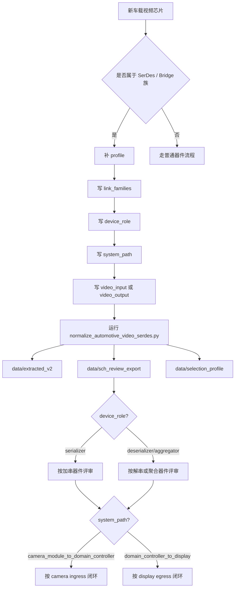

# Automotive Video SerDes 归一化

> 这份文档定义仓库里车载视频 serializer / deserializer / bridge 器件的统一表示方式，以及新同类芯片进入仓库时的处理流程。

## 1. 为什么要单独归一

这类器件有一个共同问题：

- 厂商不同
- 链路家族不同
- pin 名不同
- 但系统角色其实很像

典型例子：

- `CXD4984ER-W`
- `MAX96718A`
- 后续的 `DS90UB*`

如果只保留原始描述，比如：

- `GVIF3 deserializer`
- `Dual GMSL2/GMSL1 to CSI-2 Deserializer`

那人能看懂，但程序很难统一消费。

所以归一化的目标不是抹平厂商差异，而是把“同一类系统角色”变成统一结构。

## 2. 统一后的核心模型

归一化后，这类器件统一落到两个层次：

### 2.1 类目层

顶层 `category` 统一为：

- `Automotive Video SerDes`

这个字段用于：

- 快速筛选
- 建立最粗颗粒度的器件集合

### 2.2 能力层

真正给下游消费的统一结构是：

- `capability_blocks.serial_video_bridge`

它表达的不是品牌，而是系统角色：

- 是不是 serializer / deserializer / aggregator
- 是处在 camera ingress 还是 display egress 路径
- 串行侧用什么链路家族
- 视频侧是输入还是输出、是什么协议
- 控制面怎么进来

## 3. 标准结构

统一能力块采用下面这组字段：

```json
{
  "class": "serial_video_bridge",
  "present": true,
  "device_role": "deserializer",
  "application_domain": "automotive_camera",
  "system_path": "camera_module_to_domain_controller",
  "link_families": ["GVIF3"],
  "link_direction": "serial_in_to_video_out",
  "video_input": {},
  "video_output": {},
  "serial_links": {},
  "control_plane": {},
  "source_basis": "primary_pdf_manual_profile"
}
```

字段解释：

- `device_role`
  - `serializer` / `deserializer` / `aggregator` / `bridge`
- `application_domain`
  - 表示大类应用域，例如 `automotive_camera`、`automotive_display`、`automotive_video`
- `system_path`
  - 明确器件所在系统路径
  - 当前优先使用：
    - `camera_module_to_domain_controller`
    - `domain_controller_to_display`
- `link_families`
  - 例如 `GVIF3`、`GMSL2`、`GMSL1`、`FPD-Link III`、`FPD-Link IV`、`HSMT`
- `video_input`
  - 主要用于 serializer 侧，例如 camera 模组送进来的 `MIPI CSI-2`
- `video_output`
  - 主要用于 deserializer / bridge 侧，例如输出到 SoC 的 `MIPI CSI-2`
- `serial_links`
  - 串行侧媒介、链路数量、是否支持控制通道
- `control_plane`
  - I2C / GPIO / reset / strap / lock status

这次补上的关键点是：

- 不再只靠 `application_domain` 推断使用场景
- 用 `system_path` 显式区分 camera ingress 和 display egress
- `link_families` 现在正式收纳 `HSMT`
- serializer 现在不再被硬塞成 deserializer 变体，而是用 `device_role + video_input`

## 4. 这次已经归一到什么程度

目前已经拉齐到统一模型的代表器件有：

- `CXD4984ER-W`
- `MAX96718A`
- `MAX96712`
- `NS6012`
- `NS6603`
- `DS90UB9702-Q1`

它们现在都具备：

- `category = Automotive Video SerDes`
- `capability_blocks.serial_video_bridge`

其中：

- `CXD4984ER-W` 还保留了更完整的 `domains.protocol` 与 `capability_blocks.mipi_phy`
- `MAX96718A` 则通过 profile 补齐了可消费的统一能力结构
- `MAX96712` 代表 GMSL camera ingress aggregator / hub
- `NS6012` 代表 camera-side HSMT serializer
- `NS6603` 代表 HSMT deserializer / quad camera aggregator
- `DS90UB9702-Q1` 代表 FPD-Link IV camera ingress aggregator / hub

另外已经纳入同一注册表、但当前处于待补档状态的器件有：

- `DS90UB934TRGZRQ1`
- `DS90UB954TRGZRQ1`
- `DS90UB960WRTDRQ1`
- `DS90UB962WRTDTQ1`
- `MAX96792A`

这些器件当前被标记为：

- `DS90UB934/954/960/962`: `pending_source_reintake`
- `MAX96792A`: `pending_source_repair`

原因不是它们不属于同类，而是当前工作区里要么没有它们可安全更新的正式 `extracted/export/selection` 文件，要么 raw source 当前损坏不可解析。

## 5. 为什么不用只改 category

只改 `category` 不够。

因为下游真正关心的问题是：

- 这是 serializer 还是 deserializer
- 它是不是 multi-camera aggregator / hub
- 串行侧是 `GVIF3` 还是 `GMSL`
- 视频侧是不是 `CSI-2`
- 有没有 `C-PHY`
- 控制面是 I2C 还是别的
- 这颗器件是在 `camera -> domain controller` 还是 `domain controller -> display`
- 它是“加串”的 serializer，还是“解串/聚合”的 deserializer

这些问题都不应该靠 `description` 字符串匹配。

## 6. 下游怎么用这两个关键字段

推荐下游按下面顺序判断：

1. 先看 `category == Automotive Video SerDes`
2. 再看 `capability_blocks.serial_video_bridge.device_role`
3. 再看 `capability_blocks.serial_video_bridge.system_path`
4. 最后看 `link_families`、`video_input` / `video_output`、`control_plane`

一个简单决策表：

- `device_role = serializer`
  - 把它当作 camera-side 加串器件处理
  - 重点看 `video_input`，确认 sensor 侧 `MIPI CSI-2`、lane map、时钟和帧同步
- `device_role = aggregator`
  - 把它当作 multi-camera ingress hub 处理
  - 重点看 `serial_links.port_count`、聚合/复制能力、虚拟通道、下游 CSI-2 端口拓扑
- `system_path = camera_module_to_domain_controller`
  - 再结合 `device_role`
  - 把它当作 sensor ingress 器件处理
  - `serializer` 重点校验 sensor 侧 CSI-2、PoC、同轴/STP、远端 deserializer 配对
  - `deserializer/aggregator` 重点校验聚合模式、PoC、同轴/STP、SoC CSI-2 接收端兼容
- `system_path = domain_controller_to_display`
  - 把它当作 display egress 器件处理
  - 重点校验显示链路时序、bridge/panel 兼容、显示控制和失锁恢复

不要只看：

- `application_domain = automotive_camera`

因为它只能说明“属于哪个大类”，不能替代系统链路位置判断。

也不要只看：

- `device_role`

因为 `serializer` 既可能出现在 camera ingress，也可能以后出现在 display egress。

## 7. 新同类芯片进来时怎么处理

新器件进入时，按下面流程处理。

### Step 1: 先判断是否属于这个器件族

满足任意一组强信号，就进入 `Automotive Video SerDes` 流程：

- 描述里包含 `serializer` / `deserializer` / `aggregator`
- 出现 `GMSL` / `GVIF` / `FPD-Link` / `A-PHY` / `HSMT`
- 一侧是高速串行链路，另一侧是 `CSI-2` 或视频输出
- 文档里明确提到 control channel / sideband / pass-through I2C / lock

### Step 2: 不按厂商建模，先按系统角色建模

先抽这四块：

- 串行链路侧
- 视频输出侧
- 控制面
- 复位 / 状态 / strap

并且强制补两个决策字段：

- `link_families`
- `system_path`

如果器件属于“加串”侧，还必须补：

- `device_role = serializer`
- `video_input`

如果器件属于“解串/聚合”侧，还必须补：

- `device_role = deserializer` 或 `aggregator`
- `video_output`

不要第一步就写成：

- “Sony 模型”
- “Maxim 模型”
- “TI 模型”

因为那样会把同类器件拆成无法比较的数据孤岛。

### Step 3: 在 profile 文件里登记

当前仓库采用：

- `data/normalization/automotive_video_serdes_profiles.json`

新器件进入时：

1. 增加一个 profile 条目
2. 写清 source-backed 事实
3. 只填已经确认的字段
4. 不确定的字段先留空或省略，不要猜

### Step 4: 运行归一化脚本

使用：

```bash
python3 scripts/normalize_automotive_video_serdes.py
```

脚本会把 profile 投影到：

- `data/extracted_v2/`
- `data/sch_review_export/`
- `data/selection_profile/`

如果 profile 的状态不是 `active`，或者对应文件不存在，脚本会自动跳过并打印原因，不会伪造新数据。

### Step 5: 加回归测试

至少锁住：

- `category`
- `capability_blocks.serial_video_bridge`
- `device_role`
- `link_families`
- `system_path`
- 视频输出协议

## 8. Mermaid 图看流程



## 9. 当前边界和自治保障

当前这套归一化是“旁路增强”，不是 exporter 主干的一部分。

这有两个好处：

- 不会把主 exporter 的复杂改动一并卷进来
- 可以先稳定同类模型，再决定是否并回主流水线

当前策略适合：

- 先把同类器件拉齐
- 再逐步把规则抽象回通用 exporter

这也意味着：

- 对 `CXD4984ER-W`、`MAX96718A` 这种已有正式数据的器件，可以直接归一
- 对 `DS90UB934/954/960/962` 这种当前缺正式文件的器件，先登记到注册表，等 source 回流后再激活
- 对 `MAX96792A` 这种 raw source 已存在但文件损坏的器件，先标记 `pending_source_repair`

我现在确保自治的方法就是这 4 条：

1. 用 sidecar profile 驱动归一，不直接改动脏状态下的主 exporter
2. `active` 与 `pending_source_*` 分层，未 intake 的器件只登记，不激活
3. 归一化脚本遇到缺文件或 pending 状态会自动跳过，不会伪造导出结果
4. 用回归测试锁住 `category`、`link_families`、`system_path` 和关键 capability block

## 10. 当前 intake roadmap

这部分是当前能看到的扩展队列，不等同于都已经激活：

- 已激活:
  - `NS6012` serializer
  - `NS6603` deserializer
  - `MAX96712` aggregator
  - `DS90UB9702-Q1` aggregator
- 待 source reintake:
  - `DS90UB934TRGZRQ1`
  - `DS90UB954TRGZRQ1`
  - `DS90UB960WRTDRQ1`
  - `DS90UB962WRTDTQ1`
- 待 source repair:
  - `MAX96792A`

如果后续 `sch-review` 的 board roadmap 继续引入新的 camera-side serializer、deserializer hub、或者 display-side bridge，处理方法不变：

- 先登记到 profile
- 明确 `device_role`
- 明确 `system_path`
- 有正式 source 再激活

除此之外，现在还有一层单独的 roadmap watchlist：

- 文件位置:
  - `data/normalization/automotive_video_serdes_roadmap_watchlist.json`
- 当前已吸收的 Drive 路线图来源:
  - `FPD-Link_Automotive_Roadmap_NDA_Sales.pdf`
  - `IVI_GMSL_Roadmap_Oct2024.pptx`

这层 watchlist 只做 3 件事：

1. 记录路线图里出现过的器件
2. 先判定它属于 `camera_module_to_domain_controller` 还是 `domain_controller_to_display`
3. 先判定它更像 `serializer`、`deserializer` 还是 `aggregator`

这层 watchlist 明确不做的事：

- 不把 roadmap 当作 datasheet
- 不从 roadmap 直接生成 active 导出
- 不从 roadmap 猜具体电气规格细节

当前从路线图里已经抽出的重点方向：

- TI FPD-Link camera ingress:
  - `DS90UB971-Q1`
  - `DS90UB9722-Q1`
  - `DS90UB9724-Q1`
  - `DS90UB9742-Q1`
  - `DS90UB633A-Q1`
  - `DS90UB662-Q1`
  - `DS90UB635-Q1`
  - `DS90UB638-Q1`
- TI FPD-Link display egress:
  - `DS90UH981-Q1`
  - `DS90UH983-Q1`
  - `DS90UH984-Q1`
  - `DS90UH988-Q1`
  - `DS90UB681-Q1`
  - `DS90UB688-Q1`
- ADI GMSL IVI display egress:
  - `MAX96781`
  - `MAX96783`
  - `MAX96751`
  - `MAX96753`
  - `MAX96755`
  - `MAX96757`
  - `MAX96772`
  - `MAX96774`
  - `MAX96756`
  - `MAX96758`
  - `MAX96752`
  - `MAX96754`

## 11. 实际消费建议

下游读取这类器件时，建议优先顺序：

1. `capability_blocks.serial_video_bridge`
2. `capability_blocks.mipi_phy`
3. `constraint_blocks.serial_video_bridge`
4. `domains.protocol`
5. `packages` / `electrical_parameters`

这能让“同类筛选”和“具体接线/评审”分层进行，而不是混在一起。

如果下游只需要一句规则：

- 先用 `category` 找到车载视频 SerDes
- 再用 `device_role` 判断它是加串还是解串/聚合
- 再用 `system_path` 决定它属于 camera ingress 还是 display egress
- 再用 `link_families` 和 `video_input` / `video_output` 做兼容性和原理图闭环

如果你要处理 roadmap-only 器件，先读：

1. `data/normalization/automotive_video_serdes_roadmap_watchlist.json`
2. 看它是否已经有正式 datasheet source
3. 没有正式 source 就保持 `pending_roadmap_validation`

如果你要真正开始做下一批补档，再读：

1. `data/normalization/automotive_video_serdes_intake_queue.json`
2. 先按 batch priority 执行，不要平铺所有 roadmap 器件

当前 intake queue 的策略是：

- Priority 1:
  - 先打通 TI FPD-Link display egress 主链
  - `DS90UH981-Q1`
  - `DS90UH983-Q1`
  - `DS90UH984-Q1`
  - `DS90UH988-Q1`
- Priority 2:
  - 再打通 ADI GMSL IVI display egress 主链
  - `MAX96781`
  - `MAX96783`
  - `MAX96772`
  - `MAX96774`
- Priority 3:
  - 最后扩大到 HDMI / DSI / display CSI / oLDI 变体
  - `MAX96751`
  - `MAX96753`
  - `MAX96755`
  - `MAX96757`
  - `MAX96756`
  - `MAX96758`
  - `MAX96752`
  - `MAX96754`
  - `DS90UB681-Q1`
  - `DS90UB688-Q1`

这么排的原因不是“谁更重要”的主观判断，而是：

- 先补一条完整 serializer -> deserializer 的 display egress 主路径
- 再补另一家厂商的等价主路径
- 最后再做协议分支和派生 SKU 扩展
