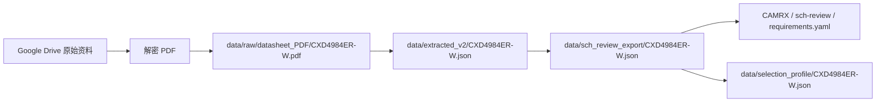
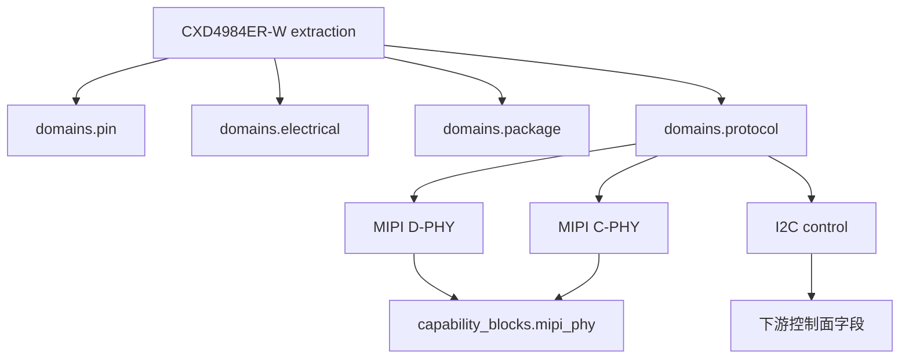
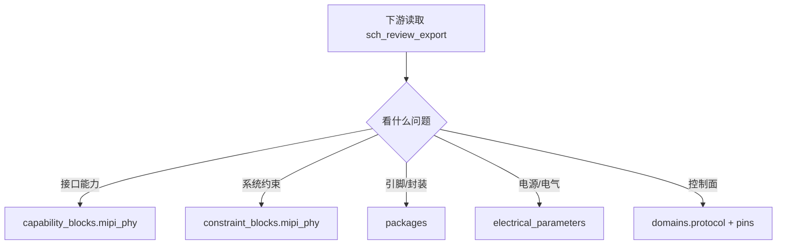

# CXD4984ER-W 闭环说明

> 这份文档说明本次 `CXD4984ER-W` 资料解析、正式落库、下游可消费字段，以及对当前系统架构造成的实际影响。

## 1. 这次做了什么

本次工作不是只在 issue 里写结论，而是把 `CXD4984ER-W` 真正落成了仓库里的正式数据资产。

已经完成的内容：

- 从 Google Drive 资料中提取并解密 Sony 原始 PDF
- 将 PDF 放入 canonical raw 路径：
  - `data/raw/datasheet_PDF/CXD4984ER-W.pdf`
- 生成正式 extraction：
  - `data/extracted_v2/CXD4984ER-W.json`
- 生成正式 sch-review 导出：
  - `data/sch_review_export/CXD4984ER-W.json`
- 生成正式 selection profile：
  - `data/selection_profile/CXD4984ER-W.json`
- 为该器件增加最小回归测试：
  - `test_cxd4984_export.py`
- 已在 GitHub issue `#25` 中补充结论和下游消费说明，并关闭 issue

## 2. 这次确认下来的核心事实

器件身份：

- 型号：`CXD4984ER-W`
- 厂商：`Sony`
- 类型：`GVIF3 deserializer`
- 封装：`VQFN-64`

MIPI 输出能力：

- 同时支持 `D-PHY` 和 `C-PHY`
- `2 ports`
- `D-PHY`：
  - 每口 `4 data lanes + 1 clock lane`
  - `260..4500 Mbps/lane`
  - `D-PHY v2.1`
  - `CSI-2 v2.1`
- `C-PHY`：
  - 每口 `3 trios`
  - `300..4500 Msps`
  - `C-PHY v1.2`
  - `CSI-2 v2.1`

控制与电源：

- `SCL0` / `SDA0`：I2C 控制
- `I2CADR`：I2C 地址选择
- `CE`：系统复位输入
- `VDDIO`：支持 `1.8V` 或 `3.3V`

## 3. 对系统架构的实际影响

这次变化主要发生在“数据层”和“下游消费层”，不是大规模改动 pipeline 主干。

### 3.1 Raw 层多了 canonical source

以前 `CXD4984` 只存在于临时 staging 和 issue 讨论里。

现在它进入了正式 raw source 目录，意味着：

- 后续追溯不再依赖临时下载链接
- 数据来源有固定文件落点
- 后续批处理、审计、人工复核都有统一入口

### 3.2 Extracted 层从“临时结果”变成“正式设备记录”

`data/extracted_v2/CXD4984ER-W.json` 现在是正式 extraction 资产。

它已经包含：

- `domains.electrical`
- `domains.pin`
- `domains.package`
- `domains.design_context`
- `domains.protocol`

其中最关键的新增是：

- `domains.protocol`

这一步很重要，因为 `C-PHY vs D-PHY` 不再只存在于人类 issue 评论里，而是进入了机器可读结构。

### 3.3 Export 层多了面向下游的 MIPI 能力表达

`data/sch_review_export/CXD4984ER-W.json` 里已经带有：

- `capability_blocks.mipi_phy`
- `constraint_blocks.mipi_phy`

这表示下游不需要再自己读 pin 名或翻 PDF 猜接口模式，直接读导出字段即可做系统决策。

### 3.4 Selection 层有了轻量入口

`data/selection_profile/CXD4984ER-W.json` 已生成。

这意味着：

- 轻量筛选工具可以发现这个器件
- 但 selection profile 只适合快速浏览
- 真正的接口决策仍应优先读 `sch_review_export`

## 4. 用图看这次变化

### 4.1 从资料到正式数据的流转

这张图的意思很简单：

- 左边是资料来源
- 中间是仓库正式数据层
- 右边是下游消费层

### 4.2 这次在系统里新增的关键结构

这张图表达的是：

- `protocol domain` 是这次闭环最关键的补充
- 它把“接口事实”提升成了结构化数据
- 然后再投影到 export 的 `capability_blocks`

### 4.3 下游应该怎么读

简单说：

- 是否支持 `C-PHY / D-PHY`：看 `capability_blocks.mipi_phy`
- 设计评审时要冻结什么：看 `constraint_blocks.mipi_phy`
- 引脚怎么接：看 `packages`
- 电源和阈值：看 `electrical_parameters`

## 5. 对下游意味着什么

### 对 CAMRX

现在可以直接认定：

- `CXD4984ER-W` 同时支持 `D-PHY` 和 `C-PHY`

因此：

- `CAMRX` 已不再被“器件资料缺失”阻塞
- 剩余选择变成系统设计决策

### 对 requirements.yaml

现在可以直接闭合这些字段：

- 接口类型支持
- port 数
- D-PHY lane 数
- C-PHY trio 数
- 速率范围
- 封装
- I2C 控制接口
- reset / address select

## 6. 当前边界

需要明确一件事：

本次已经推上 GitHub 的，是 `CXD4984ER-W` 这颗器件的正式数据资产和说明文档。

但还有一层“把 exporter 泛化到所有类似 normal-IC MIPI bridge / deserializer 自动生成同类能力块”的代码，目前仍停留在本地工作区，没有并入这次远端提交。

也就是说：

- `CXD4984ER-W` 这颗器件已经闭环
- 全局通用化能力还没有作为仓库主线能力宣布完成

## 7. 推荐读取顺序

如果你是下游使用者，推荐按这个顺序看：

1. `data/sch_review_export/CXD4984ER-W.json`
2. `data/extracted_v2/CXD4984ER-W.json`
3. `data/selection_profile/CXD4984ER-W.json`
4. GitHub issue `#25`

这样能避免先看 issue，再回头找正式字段。
